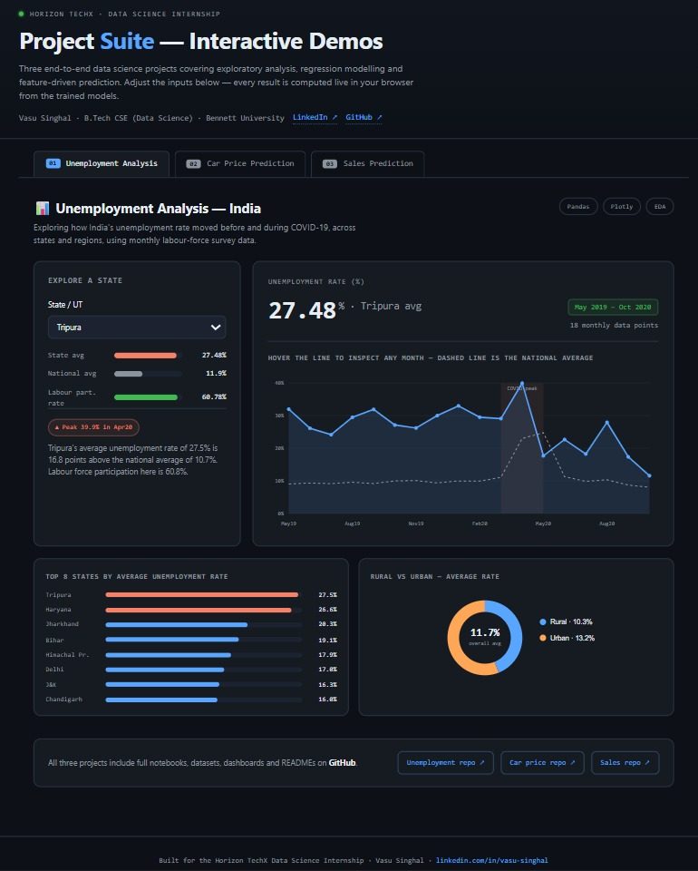
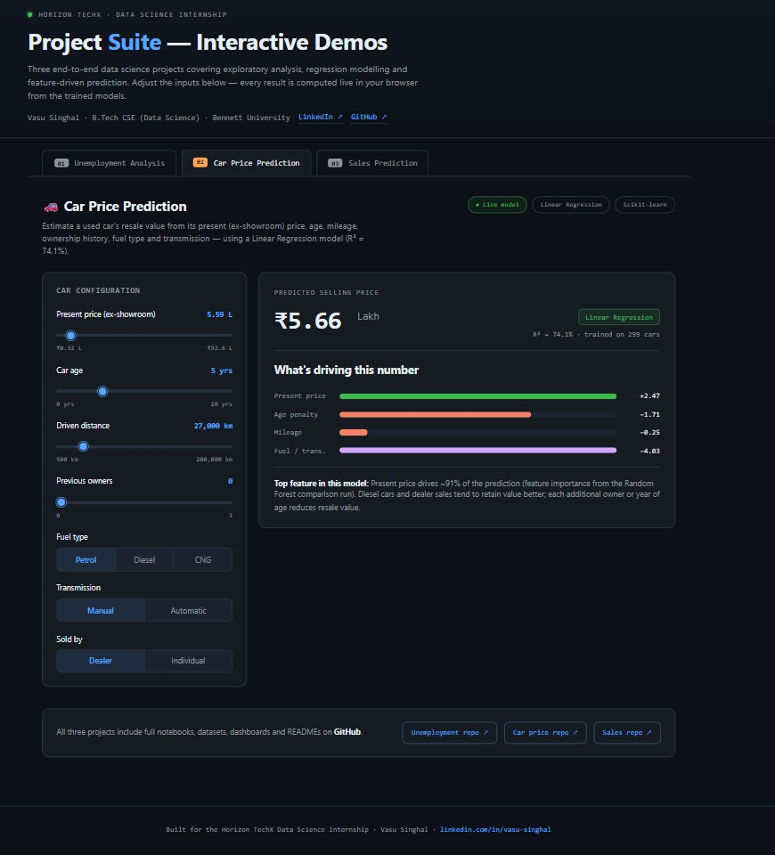
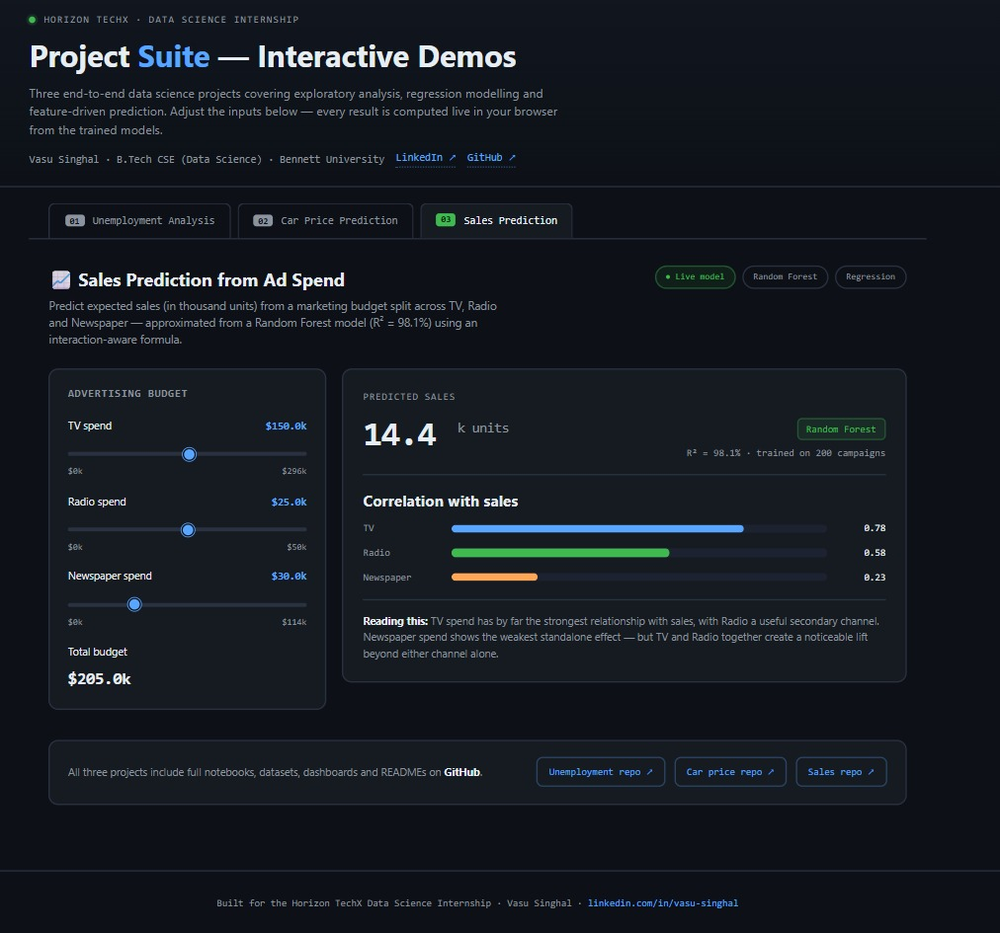

# 🚀 Horizon TechX Data Science Internship — Project Suite

Interactive demo combining all 3 Data Science Internship projects.

## 🖥️ Preview

### 📊 Unemployment Analysis

### 🚗 Car Price Prediction

### 📈 Sales Prediction

## 🔗 Live Demo
👉 [Click here to open the interactive demo](https://horizontechx-projectsuite.onrender.com)

## 📊 Projects Included
- **Task 2:** Unemployment Analysis in India (COVID-19 Impact)
- **Task 3:** Car Price Prediction Using Machine Learning
- **Task 4:** Sales Prediction Using Python

## 👤 Author
**Vasu Singhal** — B.Tech CSE (Data Science) — Bennett University

## 📄 License
MIT License
